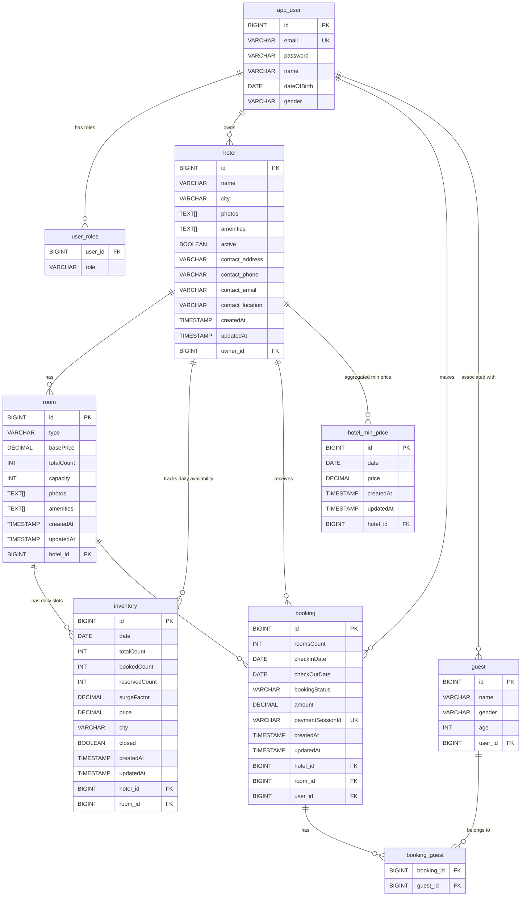

# HotelHub - Hotel Booking System

## Table of Contents

- [Project Overview](#project-overview)
- [Features](#features)
- [Tech Stack](#tech-stack)
- [System Architecture](#system-architecture)
- [Dynamic Pricing Engine](#dynamic-pricing-engine)
- [Booking Lifecycle](#booking-lifecycle)
- [Security Design](#security-design)
- [Database Design](#database-design)
- [API Endpoints](#api-endpoints)
- [Design Patterns Used](#design-patterns-used)
- [Getting Started](#getting-started)
- [Configuration](#configuration)
- [Known Limitations & Future Improvements](#known-limitations--future-improvements)
- [Author](#author)

---

## Project Overview

HotelHub is a full-featured hotel booking backend system that supports two types of users — **Hotel Managers** and **Guests**. Hotel Managers can onboard their properties, manage room inventory, configure pricing, and view revenue reports. Guests can search hotels, book rooms, add guest details, complete payments via Stripe, and cancel bookings with automatic refunds.

The system implements a **dynamic pricing engine** that adjusts room prices in real time based on occupancy, urgency, surge demand, and holidays — recalculated automatically every hour via a scheduled cron job.

---

## Features

### Guest (Customer)
- Register and login with secure JWT authentication
- Search hotels by city, check-in/check-out date, and room count
- View hotel details and available rooms with dynamic prices
- Initialize a room booking (inventory reserved immediately)
- Add guest details to a booking
- Complete payment via Stripe Checkout
- Cancel a confirmed booking with automatic Stripe refund
- View real-time booking status

### Hotel Manager (Admin)
- Create, update, and delete hotels with contact info and amenities
- Add, update, and delete rooms with type, capacity, and pricing
- Manage daily room inventory — set surge factor and close specific dates
- View all bookings for a managed hotel
- Generate revenue reports filtered by date range

### System / Background
- Hourly Spring Scheduler cron job recalculates dynamic prices for all hotels in batches
- Stripe webhook listener captures payment confirmation and drives booking state
- Pessimistic locking on inventory prevents race conditions during concurrent bookings
- Pre-aggregated `HotelMinPrice` table enables fast hotel search without complex joins

---

## Tech Stack

| Layer | Technology |
|---|---|
| Language | Java 17 |
| Framework | Spring Boot 3 |
| Security | Spring Security, JWT (jjwt 0.12.6) |
| Database | PostgreSQL |
| ORM | Spring Data JPA, Hibernate |
| Payment | Stripe Java SDK (v28.2.0) |
| Scheduling | Spring Scheduler (`@Scheduled`) |
| API Documentation | SpringDoc OpenAPI / Swagger UI (v2.8.3) |
| Object Mapping | ModelMapper (v3.2.2) |
| Utilities | Lombok, Gson |
| Build Tool | Maven |

---

## System Architecture

The project follows a standard **layered architecture**:

```
Client Request
      │
      ▼
 Controller Layer       ← Handles HTTP requests, input validation, response wrapping
      │
      ▼
  Service Layer         ← Business logic, state transitions, pricing, orchestration
      │
      ▼
Repository Layer        ← Spring Data JPA repositories, custom JPQL queries
      │
      ▼
  Database (PostgreSQL) ← Persistent storage with pessimistic locking support
```

### Cross-Cutting Concerns
- **Security**: `JWTAuthFilter` intercepts every request before reaching the controller
- **Exception Handling**: `GlobalExceptionHandler` (`@ControllerAdvice`) handles all exceptions centrally
- **Response Wrapping**: `GlobalResponseHandler` wraps all successful responses in a unified `ApiResponse<T>` structure
- **Pricing**: `PricingService` applies a chain of decorator strategies at booking time and via scheduled job

---

## Dynamic Pricing Engine

The pricing engine uses the **Decorator Pattern** to compose multiple pricing strategies in sequence. Each strategy wraps the previous one and applies a multiplier if its condition is met.

```
Base Price
    │
    ▼
Surge Pricing Strategy       ← Manual multiplier set by hotel manager per inventory date
    │
    ▼
Occupancy Pricing Strategy   ← +20% if room occupancy exceeds 80%
    │
    ▼
Urgency Pricing Strategy     ← +15% if check-in is within the next 7 days
    │
    ▼
Holiday Pricing Strategy     ← +25% on public/national holidays (via Nager.Date API)
    │
    ▼
Final Price per Night
```

**Total Booking Amount** = Sum of (daily price × number of rooms) across all nights in the booking window.

Prices are **recalculated hourly** by a background `@Scheduled` cron job that processes all hotels in batches of 100 and updates both the `Inventory` table and the denormalized `HotelMinPrice` table.

### Holiday Detection — `HolidayService`

The `HolidayService` powers the `HolidayPricingStrategy` using the **[Nager.Date API](https://date.nager.at)** — a free, no-key-required public holiday API supporting India (`IN`) and all other countries.

| Feature | Detail |
|---|---|
| API endpoint | `https://date.nager.at/api/v3/PublicHolidays/{year}/IN` |
| API key required | No |
| Cache strategy | `ConcurrentHashMap` keyed by year — fetched once per year, reused for all calculations |
| Fail-safe | If API is unreachable, returns empty set — no holiday pricing applied, no exception thrown |
| Country | India (`IN`) — configurable by changing the country code |

---

## Booking Lifecycle

Every booking moves through a well-defined state machine enforced at the service layer:

```
  [POST /bookings/init]
         │
         ▼
      RESERVED          ← Inventory reserved with pessimistic lock; 15-min window to complete
         │
  [POST /bookings/{id}/addGuests]
         │
         ▼
    GUESTS_ADDED        ← Guest details validated and persisted
         │
  [POST /bookings/{id}/payments]
         │
         ▼
  PAYMENT_PENDING       ← Stripe checkout session created; awaiting payment
         │
  [Stripe Webhook]
         │
         ├──── Success ──────▶  CONFIRMED    ← reservedCount → bookedCount in inventory
         │
         └──── [POST /bookings/{id}/cancel]
                                CANCELLED    ← bookedCount decremented; Stripe refund initiated
```

---

## Security Design

### JWT Authentication
- **Access Token**: 10-minute expiration — used for all API requests
- **Refresh Token**: 6-month expiration — used to obtain a new access token without re-login
- **Token Claims**: User ID (subject), email, roles
- **Algorithm**: HMAC-SHA (configured via `jwt.secretKey`)

### Request Filter Chain
Every HTTP request passes through `JWTAuthFilter`:
1. Extracts Bearer token from `Authorization` header
2. Validates signature, expiry, and claims
3. Populates `SecurityContextHolder` with user details
4. On failure, delegates to `HandlerExceptionResolver` for a structured error response

### Role-Based Access Control (RBAC)

| Route Pattern | Required Role |
|---|---|
| `/api/v1/admin/**` | `ROLE_HOTEL_MANAGER` |
| `/api/v1/bookings/**` | Any authenticated user |
| `/api/v1/users/**` | Any authenticated user |
| `/api/v1/auth/**` | Public |
| `/api/v1/hotels/**` (browse) | Public |

### Additional Security Measures
- **BCrypt** password hashing for stored passwords
- **Stripe webhook signature validation** — prevents spoofed payment events
- **Ownership validation** — users can only access/modify their own bookings; managers can only manage their own hotels
- **Stateless sessions** — no server-side session storage (CSRF disabled)

---

## Database Design

### Core Entities

| Entity | Purpose |
|---|---|
| `User` | Registered users — both Guests and Hotel Managers |
| `Hotel` | Hotel properties owned by a Manager |
| `Room` | Room types within a hotel (Single, Double, Suite, etc.) |
| `Inventory` | Daily room availability, pricing, and booking counts per room |
| `Booking` | Customer reservation linking User, Hotel, Room, and Guests |
| `Guest` | Individual guests within a booking |
| `HotelMinPrice` | Denormalized minimum price per hotel per date for fast search |
| `HotelContactInfo` | Embedded contact details (address, email, phone, location) |

### Entity Relationship Diagram



### Key Design Decisions

- **`HotelMinPrice` table**: Pre-aggregated minimum prices eliminate expensive `GROUP BY` joins during hotel search, enabling efficient paginated queries.
- **Pessimistic Write Lock** on `Inventory`: Prevents two concurrent bookings from over-reserving the same room slots.
- **Unique constraint** on `(hotel_id, room_id, date)` in `Inventory`: Ensures one inventory record per room per day.
- **Atomic `@Modifying` queries**: Inventory counts (`reservedCount`, `bookedCount`) are updated atomically at the DB level, not in-memory, to prevent data inconsistency.

### Inventory Counters (per room per day)

```
totalCount    = Total physical rooms available
reservedCount = Rooms currently in RESERVED/PAYMENT_PENDING state
bookedCount   = Rooms in CONFIRMED bookings
closed        = Flag to block the date from any booking
```

Available rooms = `totalCount - bookedCount - reservedCount`

---

## API Endpoints

> Full interactive documentation available at: `http://localhost:8080/swagger-ui.html`

### Authentication (`/api/v1/auth`)

| Method | Endpoint | Description | Auth Required |
|---|---|---|---|
| POST | `/auth/signup` | Register a new user | No |
| POST | `/auth/login` | Login and receive access + refresh tokens | No |
| POST | `/auth/refresh` | Get a new access token using refresh token | No |

### Hotel Browse (`/api/v1`)

| Method | Endpoint | Description | Auth Required |
|---|---|---|---|
| GET | `/hotels/search` | Search hotels by city, dates, and room count | No |
| GET | `/hotels/{id}/info` | Get full hotel details with rooms and pricing | No |

### Booking (`/api/v1/bookings`)

| Method | Endpoint | Description | Auth Required |
|---|---|---|---|
| POST | `/bookings/init` | Initialize booking and reserve inventory | Yes |
| POST | `/bookings/{id}/addGuests` | Add guest details to a booking | Yes |
| POST | `/bookings/{id}/payments` | Create Stripe checkout session | Yes |
| POST | `/bookings/{id}/cancel` | Cancel booking and trigger refund | Yes |
| GET | `/bookings/{id}/status` | Get current booking status | Yes |

### Hotel Admin (`/api/v1/admin/hotels`) — `ROLE_HOTEL_MANAGER` only

| Method | Endpoint | Description |
|---|---|---|
| POST | `/admin/hotels` | Create a new hotel |
| GET | `/admin/hotels` | List all hotels managed by current user |
| GET | `/admin/hotels/{id}` | Get hotel details |
| PUT | `/admin/hotels/{id}` | Update hotel info |
| DELETE | `/admin/hotels/{id}` | Delete hotel (cascades to rooms and inventory) |
| PATCH | `/admin/hotels/{id}/activate` | Publish / activate hotel |
| POST | `/admin/hotels/{hotelId}/rooms` | Add a room to a hotel |
| GET | `/admin/hotels/{hotelId}/rooms` | List all rooms in a hotel |
| GET | `/admin/hotels/{hotelId}/rooms/{roomId}` | Get room details |
| PUT | `/admin/hotels/{hotelId}/rooms/{roomId}` | Update room details |
| DELETE | `/admin/hotels/{hotelId}/rooms/{roomId}` | Delete a room |
| GET | `/admin/hotels/{id}/bookings` | View all bookings for a hotel |
| GET | `/admin/hotels/{id}/reports` | Revenue report for a date range |

### Inventory Admin (`/api/v1/admin/inventory`) — `ROLE_HOTEL_MANAGER` only

| Method | Endpoint | Description |
|---|---|---|
| GET | `/admin/inventory/rooms/{roomId}` | View daily inventory for a room |
| PATCH | `/admin/inventory/rooms/{roomId}` | Update surge factor or close specific dates |

### Webhook (`/webhook`)

| Method | Endpoint | Description |
|---|---|---|
| POST | `/webhook/payment` | Stripe webhook for payment confirmation |

---

## Design Patterns Used

| Pattern | Where Applied |
|---|---|
| **Decorator** | Dynamic pricing — each strategy wraps the previous one |
| **Strategy** | Interchangeable pricing algorithms (Surge, Occupancy, Urgency, Holiday) |
| **Builder** | All JPA entities and DTOs via Lombok `@Builder` |
| **DTO (Data Transfer Object)** | Clean separation between API layer and persistence layer using ModelMapper |
| **Repository** | Data access abstraction via Spring Data JPA interfaces |
| **State Machine** | Booking lifecycle with enforced state transitions |
| **Global Exception Handler** | Centralized error handling via `@ControllerAdvice` |

---

## Getting Started

### Prerequisites

- Java 17 or higher
- PostgreSQL 14+
- Maven 3.8+
- A [Stripe account](https://dashboard.stripe.com) (test mode is sufficient)

### Setup Steps

**1. Clone the repository**
```bash
git clone https://github.com/your-username/HotelHub.git
cd HotelHub
```

**2. Create the PostgreSQL database**
```sql
CREATE DATABASE HotelHub;
```

**3. Configure `application.properties`**

Open `src/main/resources/application.properties` and fill in the values described in the [Configuration](#configuration) section below.

**4. Run the application**
```bash
mvn spring-boot:run
```

**5. Access Swagger UI**

Open your browser and navigate to:
```
http://localhost:8080/swagger-ui.html
```

**6. Set up Stripe Webhook (for local testing)**

Install the [Stripe CLI](https://stripe.com/docs/stripe-cli) and forward events to your local server:
```bash
stripe listen --forward-to http://localhost:8080/webhook/payment
```
Copy the webhook secret printed by the CLI and set it as `stripe.webhookSecret` in your properties.

---


